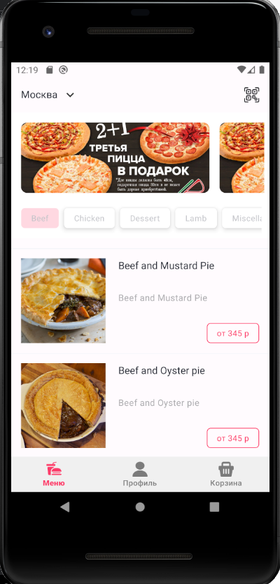
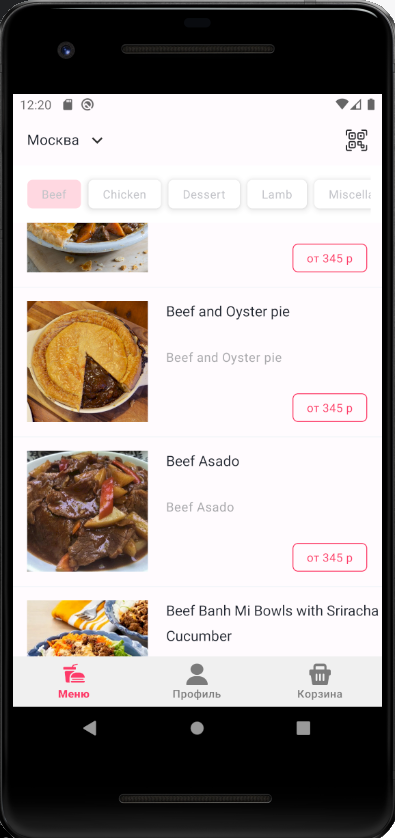

# DeliveryFood

Для Offline-режима можно реализовать локальную базу данных с помощью Room, загружать туда данные из сети. В случае, если сети нет, выгружаем данные из базы. Не успел реализовать, к сожалению. Основа для базы данных в слое data заложена.

